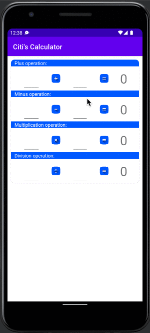

# MathCalcularor (Citi)

Very basic calculator based on MVVM architecture. used libraries/features:
* <b>RXJava3</b> - Observer Pattern
* <b>RxBinding</b> - Observer Pattern for UI widgets
* <b>Hilt</b> - Dependency Injection
* 

